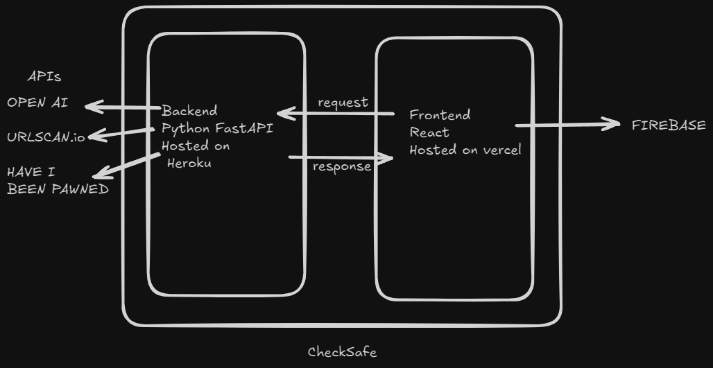

# CheckSafe

### CheckSafe is a cybersafty web app, it has three main functionalities:

    1- Scan Urls for possible threats and dangers
    2- check if email informations have been leaked in a data breach
    3- chat with opan ai chatgpt

### the use of AI
AI was used mainly in the fronend. it was used to generate css that we later changed to match our vision, also it was used to help with debugging and to fix random errors all throughout the project, also it helped with setting up the connection with firebase and firestore and fixed some bugs.
The AI used was openAI Chatgpt 4o.

### Here is a simple image with the app structure:

# setting up
in order to set up and run the app after cloning the repo, you have to run the backedn and front end seperatly.

### backend:
1- set up the .env

    URLSCAN_API_KEY = "your urlscan.io api key" 
    HIBP_API_KEY =  "your have I been pawned api key"
    OPENAI_API_KEY= 'your openai api key'

2- install all the requirements uisng
    
    pip install requirements.txt
    
3- run the server using

    uvicorn main:app --reload

### frontend:
1- set up the .env

    REACT_APP_BACKEND_URL= "the url to the backend"

2- set up the firebase.js

    const firebaseConfig = {
        // the config file will be provided by firebase
    };

3- install all the requirements using
    
    npm install

4- run the app using
    
    npm start